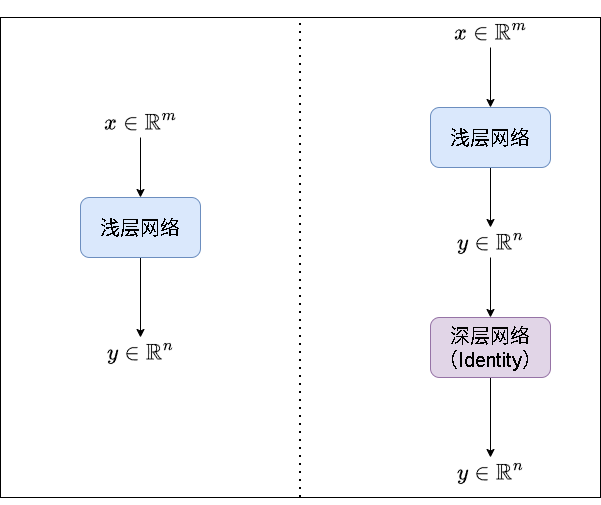
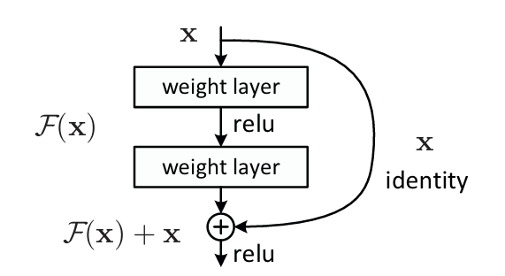

# 反向传播(BP)与残差连接

我们今天不写代码，主要是从**原理**上理解一个对于**深度学习**非常重要的一个算法-**反向传播(BP)**，以及一种和它相关的改进-**残差连接**，这种改进使得现代深度网络的训练成为可能，它解决了网络层数变深反而让网络效果变差的关键问题，接下来我们就一起来学习一下BP算法以及残差连接的思想

## 反向传播(BP)

### 前置知识

#### 1. 求导后向量/矩阵的意义

对于**标量对向量的导数**而言，假设向量$\vec{x} = \begin{bmatrix} x_1, \cdots, x_n \end{bmatrix}^T$的函数$f(\vec{x})$(结果是标量)，求导数(梯度)可以得到: 

$$
\frac{\partial f}{\partial \vec{x}} = \begin{bmatrix} \frac{\partial f}{\partial x_1}, \cdots, \frac{\partial f}{\partial x_n} \end{bmatrix}^T
$$

也就是函数$f$对于每一个$x$的**偏导**;

对于**标量对矩阵的导数**而言，假设矩阵$X \in \mathbb{R}^{m \times n} = 
\begin{bmatrix}
x_{11} & x_{12} & \cdots & x_{1n} \\
x_{21} & x_{22} & \cdots & x_{2n} \\
\vdots & \vdots & \ddots & \vdots \\
x_{m1} & x_{m2} & \cdots & x_{mn}
\end{bmatrix}$的函数$f(X)$，求导数(梯度)可以得到:

$$
\frac{\partial f}{\partial X} = 
\begin{bmatrix}
\frac{\partial f}{\partial x_{11}} & \frac{\partial f}{\partial x_{12}} & \cdots & \frac{\partial f}{\partial x_{1n}}\\
\frac{\partial f}{\partial x_{21}} & \frac{\partial f}{\partial x_{22}} & \cdots & \frac{\partial f}{\partial x_{2n}} \\
\vdots & \vdots & \ddots & \vdots \\
\frac{\partial f}{\partial x_{m1}} & \frac{\partial f}{\partial x_{m2}} & \cdots & \frac{\partial f}{\partial x_{mn}}
\end{bmatrix}
$$

同样也是函数$f$对于每一个$x$的**偏导**;

对于**向量对向量的导数**而言，以线性变换为例，假设我们有$\vec{y} = A \vec{x}$，且$\vec{x} = \begin{bmatrix} x_1, \cdots, x_n \end{bmatrix}^T, \vec{y} = \begin{bmatrix} y_1, \cdots, y_m \end{bmatrix}^T, \quad A \in \mathbb{R}^{m \times n}$，那么我们求$\vec{y}$对$\vec{x}$的导数，就有:

$$
\frac{\partial \vec{y}}{\partial \vec{x}} = A
$$

而$A_{ij}$就表示$y_i$对$x_j$的导数，因为$y_i = \sum_{j=1}^n A_{ij}x_j$，求$y_i$对于$x_j$的偏导就只跟$A_{ij}x_j$有关(对于$x_k, k \neq j$，求$A_{ik}x_k$对$x_j$的偏导为0)，对$x_j$求导就是$A_{ij}$

#### 2. 链式法则求导

假设最终结果$y$为标量，中间变量$\vec{z} = \begin{bmatrix} z_1, \cdots, z_m \end{bmatrix}^T$，直接输入为$\vec{x} = \begin{bmatrix} x_1, \cdots, x_n \end{bmatrix}^T$，我们要求$y$对$\vec{x}$的导数，实际上就是套了一个中间函数的**复合函数求导**，从外层往内层($y$往$\vec{z}$再往$\vec{x}$)依次求导再相乘得到:

$$
\frac{\partial y}{\partial \vec{x}} = (\frac{\partial \vec{z}}{\partial \vec{x}})^T \frac{\partial y}{\partial \vec{z}} \tag{1}
$$

随便找一个元素$\frac{\partial y}{\partial x_1}$看一下，每个$z$都与$x_1$有关系，那么就有$\frac{\partial y}{\partial x_1} = \sum_{i=1}^m \frac{\partial y}{\partial z_i} \frac{\partial z_i}{\partial x_1}$，而$\frac{\partial z_i}{\partial x_1}$就是$\frac{\partial \vec{z}}{\partial \vec{x}}$第一列的元素，那么我们写成矩阵相乘的形式就是:

$$
\frac{\partial y}{\partial x_1} = \frac{\partial \vec{z}}{\partial \vec{x}}[:, 1]^T \frac{\partial y}{\partial \vec{z}}
$$

扩展为$\vec{x}$之后，就得到了(1)式了

#### 3. 逐元素函数的导数

假设$\vec{x} = \begin{bmatrix} x_1, \cdots, x_n \end{bmatrix}^T$，函数$\sigma(\vec{x}) = \begin{bmatrix} \sigma(x_1), \cdots, \sigma(x_n) \end{bmatrix}^T$，即**函数$\sigma$对$\vec{x}$逐元素作用**，那么导数$\frac{\partial \sigma(\vec{x})}{\partial \vec{x}} = \text{diag}(\sigma'(x_1), \cdots, \sigma'(x_n))$，其中diag表示对角矩阵，即:

$$
\begin{align*}
\frac{\partial \sigma(\vec{x})}{\partial \vec{x}} 

&= \text{diag}(\sigma'(x_1), \cdots, \sigma'(x_n))

\\&= 
\begin{bmatrix}
\sigma'(x_1) & 0 & \cdots & 0 \\ 
0 & \sigma'(x_2) & \cdots & 0 \\
\vdots & \vdots & \ddots & \vdots \\
0 & 0 & \cdots & \sigma'(x_n)
\end{bmatrix}
\end{align*}
$$

#### 4. 线性函数的导数

对于线性函数$\vec{z} = W \vec{x} + \vec{b}, \quad W \in \mathbb{R}^{m \times n}, \quad \vec{x} = \begin{bmatrix} x_1, \cdots, x_n \end{bmatrix}^T, \quad \vec{z} = \begin{bmatrix} z_1, \cdots, z_m \end{bmatrix}^T, \quad \vec{b} = \begin{bmatrix} b_1, \cdots, b_m \end{bmatrix}^T$，并且$\mathcal{L} = f(\vec{z})$，套用**链式法则**，我们有:

$$
\begin{align*}
\frac{\partial \mathcal{L}}{\partial W} = \frac{\partial \mathcal{L}}{\partial \vec{z}} \vec{x}^T \tag{2}

\\

\frac{\partial \mathcal{L}}{\partial \vec{b}} = \frac{\partial \mathcal{L}}{\partial \vec{z}} \tag{3}
\end{align*}
$$

我们主要看$\frac{\partial \mathcal{L}}{\partial W}$，以$\frac{\partial \mathcal{L}}{\partial W_{ij}}$为例，我们有$\frac{\partial \mathcal{L}}{\partial W_{ij}} =\frac{\partial \mathcal{L}}{\partial z_i} \frac{\partial z_i}{W_{ij}} = \frac{\partial \mathcal{L}}{\partial z_i} x_j$，那么以$\frac{\partial \mathcal{L}}{\partial W}$的**第一行为例**，我们有:

$$
\frac{\partial \mathcal{L}}{\partial W}[1, :] = \begin{bmatrix} \frac{\partial \mathcal{L}}{\partial z_1} x_1, \cdots, \frac{\partial \mathcal{L}}{\partial z_1} x_n \end{bmatrix} = \frac{\partial \mathcal{L}}{\partial z_1} \vec{x}^T
$$

对所有行推广后，即得(2)式

### 反向传播推导

对于一个标准的**MLP**，我们假设$l$用于标记网络的第$l$层，$\vec{z_l} = W_l \vec{h_l} + \vec{b_l}, \quad \vec{h_{l+1}} = \sigma(\vec{z_l})$，即$\vec{h_{l+1}}$为网络第$l$层的输出，$\vec{h_l}$为网络第$l$层的输入，$\vec{z_l}$为网络第$l$层的线性变换结果，$\sigma$为激活函数

我们还需要引入一个**误差信号**$\delta$，即第$l$层的误差信号$\delta_l = \frac{\partial \mathcal{L}}{\partial \vec{z_l}}$

#### 误差信号的反向传播

假设网络有$L$层，那么最终输出就是$\vec{h_{L+1}}$，那么这一层的信号误差就是:

$$
\begin{align*}
\delta_{L} &= \frac{\partial \mathcal{L}}{\partial \vec{z_L}}

\\&= \left( \frac{\partial \vec{h_{L+1}}}{\partial \vec{z_L}} \right)^T \frac{\partial \mathcal{L}}{\partial \vec{h_{L+1}}} & (链式法则)

\\&= \text{diag}\left( \sigma'(\vec{z_L}) \right) \frac{\partial \mathcal{L}}{\partial \vec{h_{L+1}}}

\\&= \frac{\partial \mathcal{L}}{\partial \vec{h_{L+1}}} \odot \sigma'(\vec{z_L})
\end{align*}
$$

其中，$\frac{\partial \mathcal{L}}{\partial \vec{h_{L+1}}}$是我们能够根据具体的损失函数求导得到的，$\odot$表示逐元素相乘，$\sigma'(\vec{z_L}) = \begin{bmatrix} \sigma'(z_L[1]), \sigma'(z_L[2]),  \cdots \end{bmatrix}^T$

可以转换成逐元素相乘，是因为对角矩阵和一个向量相乘等价于逐元素乘法，即:

$$
\text{diag}(a_1, a_2, \cdots) \cdot \begin{bmatrix} b_1 \\ b_2 \\ \vdots \end{bmatrix}

= \begin{bmatrix} a_1b_1 \\ a_2b_2 \\ \vdots \end{bmatrix}

= \begin{bmatrix} a_1 \\ a_2 \\ \vdots \end{bmatrix} \odot \begin{bmatrix} b_1 \\ b_2 \\ \vdots \end{bmatrix}
$$

接下来就需要从输出层一直**反向传播**这个误差信号，即已知$\delta_{l+1} = \frac{\partial \mathcal{L}}{\partial \vec{z_{l+1}}}$，求$\delta_{l} = \frac{\partial \mathcal{L}}{\partial \vec{z_{l}}}$，那么因为向前传播时，依赖链为$\vec{z_l} \rightarrow \vec{h_{l+1}} \rightarrow \vec{z_{l+1}} \rightarrow \cdots \rightarrow \mathcal{L}$，那么依据**链式法则**，我们有:

$$
\begin{align*}
\delta_{l} 

&= \frac{\partial \mathcal{L}}{\partial \vec{z_{l}}}

\\&= \left(\frac{\partial \vec{z_{l+1}}}{\partial \vec{z_l}}\right)^T \frac{\partial \mathcal{L}}{\partial \vec{z_{l+1}}}

\\&= \left(\frac{\partial \vec{z_{l+1}}}{\partial \vec{z_l}}\right)^T \delta_{l+1}
\end{align*}
$$

那么我们就要求出$\frac{\partial \vec{z_{l+1}}}{\partial \vec{z_l}}$，根据依赖链$\vec{z_l} \rightarrow \vec{h_{l+1}} \rightarrow \vec{z_{l+1}}$，我们有:

$$
\begin{align*}
\frac{\partial \vec{z_{l+1}}}{\partial \vec{z_l}} 

&= \frac{\partial \vec{z_{l+1}}}{\partial \vec{h_{l+1}}} \frac{\partial \vec{h_{l+1}}}{\partial \vec{z_l}}

\\&= W_{l+1} \cdot \text{diag}(\sigma'(\vec{z_l}))
\end{align*}
$$

带入得:

$$
\begin{align*}
\delta_{l}

&= \left(\frac{\partial \vec{z_{l+1}}}{\partial \vec{z_l}}\right)^T \delta_{l+1}

\\&= \left( W_{l+1} \cdot \text{diag}(\sigma'(\vec{z_l})) \right)^T \delta_{l+1}

\\&= W_{l+1}^T \delta_{l+1} \odot \sigma'(\vec{z_l})
\end{align*}
$$

#### 权重和偏置的梯度

我们已知$\delta_l = \frac{\partial \mathcal{L}}{\partial \vec{z_l}}$，且$\vec{z_l} = W_l \vec{h_l} + \vec{b_l}$，那么求损失对这一层的权重$W_l$的梯度就是:

$$
\begin{align*}
\frac{\partial \mathcal{L}}{\partial W_l} 

&= \frac{\partial \mathcal{L}}{\partial \vec{z_l}} \vec{h_l}^T & (依据式子(2))

\\&= \delta_l \vec{h_l}^T
\end{align*}
$$

同样地，套用(3)式，对该层偏置的权重就是:

$$
\begin{align*}
\frac{\partial \mathcal{L}}{\partial \vec{b_l}}

&= \frac{\partial \mathcal{L}}{\partial \vec{z_l}} & (依据式子(3))

\\&= \delta_l
\end{align*}
$$

这样，我们就能从输出层开始，一直向前计算出该层的误差信号，再根据该层输入计算损失对该层的权重和偏置的梯度，他跟向前传播的方向正好相反，因此称这个算法为**反向传播**，之后就可以根据计算出的梯度，应用**梯度下降**更新参数从而对模型进行优化

## 残差连接
([**论文地址: Deep Residual Learning for Image Recognition**](https://arxiv.org/pdf/1512.03385))

有了反向传播，再深层的网络我们也能够求出每一层参数的梯度，再依据目标损失函数优化模型的参数，从而达到我们的目标。然而实际上，如果把网络层数**加到一定的深度**时，模型的性能**不增反减**，成为了当时困扰学术界的一个大问题

何凯明等人认为，**深层网络的效果一定会比浅层网络的效果更好**，假设我们的输入$x$输入浅层网络后输出$y$，如果加深网络，那么就把$y$输入到深层网络中，如果深层的网络能够很好的学习到一个**恒等映射(Identity Mapping，即$f(x) = x$)**，即输出还是$y$，那么至少深层模型的效果应该与浅层模型差不多，而不是变得更差，但是**事实**就是深层模型的效果变差了，说明**更深层的网络不能很好地学习到这个恒等映射**，如下图所示:

    

所以作者就提出了一个思路: **把网络的输出和输入相加作为这一层网络最终的输出，从而让网络更容易学习到恒等映射**，如果网络的输出$f(x) = 0$，模型学习到的就是一个恒等映射$y = x$了，因为输出$y = f(x) + x$，所以模型实际上学习的是$y - x$，我们称之为**残差**，应用了这个思路的网络作者就称之为**残差网络(ResNet)**，如下图所示:

    

上面是作者的**直觉设计**，我们从**反向传播**的角度出发，看看为什么残差连接能够更好地训练深层网络:

我们的模型线性映射的公式，在应用了残差连接后就变为了(假设一个残差块就是一层MLP):

$$
\vec{z_l} = W_l \vec{h_l} + \vec{b_l}

\\

\vec{h_{l+1}} = \sigma(\vec{z_l}) + \vec{h_l}
$$

其余部分是不变的，那么我们就分析残差连接的情况下反向传播的梯度:

输出层的误差信号仍然为: $\delta_L = \frac{\partial \mathcal{L}}{\partial \vec{h_{L+1}}} \odot \sigma'(\vec{z_L})$

重点是中间层的误差信号:

对于第$l$层的误差信号，我们关注误差信号向$l$层传递时产生的变化:

$$
\begin{align*}
\delta_l 

&= \frac{\partial \mathcal{L}}{\partial \vec{z_l}}

\\&= \left( \frac{\partial \vec{h_{l+1}}}{\partial \vec{z_l}} \right)^T \frac{\partial \mathcal{L}}{\partial \vec{h_{l+1}}} & (残差连接直接改变h_{l}，因此中间量用h_{l+1})
\end{align*}
$$

我们先推出$\frac{\partial \mathcal{L}}{\partial \vec{h_l}}$的形式，他有两条传播路径: $\vec{h_{l}} \rightarrow \vec{z_{l}} \rightarrow \sigma(\vec{z_{l}}) \rightarrow \vec{h_{l+1}}$和$\vec{h_{l}} \rightarrow \vec{h_{l}} \rightarrow \vec{h_{l+1}}$，就有:

$$
\begin{align*}
\frac{\partial \mathcal{L}}{\partial \vec{h_l}}

&= \left(\frac{\partial \vec{z_l}}{\partial \vec{h_l}}\right)^T \frac{\partial \mathcal{L}}{\partial \vec{\vec{z_l}}} + \left(\frac{\partial \vec{h_{l+1}}}{\partial \vec{h_l}}\right)^T \frac{\partial \mathcal{L}}{\partial \vec{h_{l+1}}}

\\&= W_l^T \delta_l + I^T \frac{\partial \mathcal{L}}{\partial \vec{h_{l+1}}}

\\&= W_l^T \delta_l + \frac{\partial \mathcal{L}}{\partial \vec{h_{l+1}}}
\end{align*}
$$

带入$\delta_l$得:

$$
\begin{align*}
\delta_l 

&= \left( \frac{\partial \vec{h_{l+1}}}{\partial \vec{z_l}} \right)^T \left( W_{l+1}^T \delta_{l+1} + \frac{\partial \mathcal{L}}{\partial \vec{h_{l+2}}} \right) 

\\&= \text{diag}(\sigma'(\vec{z_l})) \left( W_{l+1}^T \delta_{l+1} + \frac{\partial \mathcal{L}}{\partial \vec{h_{l+2}}} \right) 

\\&= W_{l+1}^T \delta_{l+1} \odot \sigma'(\vec{z_l}) + \frac{\partial \mathcal{L}}{\partial \vec{h_{l+2}}} \odot \sigma'(\vec{z_l})
\end{align*}
$$

而权重和偏置的梯度形式上仍然不变:

$$
\frac{\partial \mathcal{L}}{\partial W_l} = \delta_l \vec{h_l}^T

\\

\frac{\partial \mathcal{L}}{\partial \vec{b_l}} = \delta_l
$$

我们可以看到与非残差连接网络唯一的不同就是$\delta_l$多了一个新的路径传递部分$\frac{\partial \mathcal{L}}{\partial \vec{h_{l+2}}} \odot \sigma'(\vec{z_l})$，如果**没有残差连接**，第$l$层的损失信号可以展开为:

$$
\delta_l =  \left(\prod_{a = l+1}^L \text{diag}(\sigma'(\vec{z_{a-1}})) W^T_a \right) \cdot \delta_L
$$

如果层数$l$比较浅并且连乘项中**大多数项都很小**，最后得到的$\delta_l$就**趋近于0**，就产生了**梯度消失**的问题，它使得网络的训练变得困难

如果有残差连接，$W_{l+1}^T \delta_{l+1} \odot \sigma'(\vec{z_l})$这一项仍然会出现梯度消失的情况，但是我们还有一个$\frac{\partial \mathcal{L}}{\partial \vec{h_{l+2}}} \odot \sigma'(\vec{z_l})$项可以传递梯度，那么我们展开这一项:

$$
\frac{\partial \mathcal{L}}{\partial \vec{h_{l+2}}} \odot \sigma'(\vec{z_l}) = \sigma'(\vec{z_l}) \odot \left( \sum_{a=l+2}^L W_a^T \delta_a + \frac{\partial \mathcal{L}}{\partial \vec{h_{L+1}}} \right)
$$

也就是说，不管怎么样，我们最坏的情况下都有$\sigma'(\vec{z_l}) \odot \frac{\partial \mathcal{L}}{\partial \vec{h_{L+1}}}$这一项(直接来自于输出层)把梯度从输出层传递到第$l$层，也就是避免了**连乘**从而让梯度传递了下来，这样就能够缓解**梯度消失**的问题了
