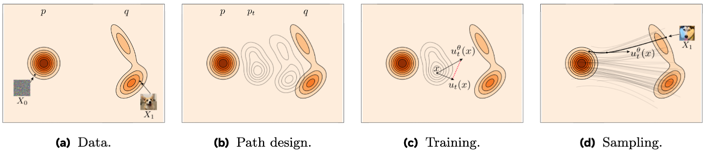

# Flow Matching 原理推导

## 直观上理解 Flow Matching

假设我们有一个源分布$p(x)$，目标分布$q(x)$，我们的目标是让源分布$p(x)$经过中间的过程变换为目标分布$q(x)$，这个中间的过程我们就称为**Flow**；

假设我们经过$t$步变换($t \in [0, 1]$，理论上上是连续的变换而非离散的)得到目标分布$q(x)$，那么我们就定义一个速度场$u_t(x)$，用于表示当前时刻的样本如何向下一时刻进行变化，那么我们的目标其实就是使用神经网络"预测"每一步需要的速度场$u_\theta(x_t, t)$，从而利用每一个时间步的速度场让源分布$p(x)$向目标分布$q(x)$流动(ODE求解)

    

<h4 align="center">Flow Matching 示例</h4>

为了接下来的详细解释，我们需要先声明几个概念:

1. 概率路径$p_t(x)$: 表示$t$时刻时，$x$的概率分布，即每个位置上出现样本点的概率密度

2. 流映射$\phi_t$: 描述单个粒子点如何随时间$t$流动到终点，假设起点为$x_0$，终点为$x_1$，那么就用$\phi_t(x_0:x_1)$表示在$x_0$向$x_1$流动的过程中，$t$时刻粒子的位置$x_t$

## Flow Matching 的原理

其实就是求解如下 ODE 方程的过程:

$$
\frac{d\phi_t(x_0)}{dt} = v_t(\phi_t(x_0))
$$

采样时$v_t(\phi_t(x))$为模型预测得到，那么从先验分布(如标准高斯分布)$p(x)$得到目标分布$q(x)$的过程表达为，采样的所有点$x_0$经过流映射作用之后，到达自身对应终点$x_1$:

$$
x_1 = x_0 + \int_0^1 v_t(\phi_t(x_0)) dt
$$

直觉上的理解就是，从$x_0$出发，经过$t$从0到1的过程变化位置之后，得到$x_1$的过程，所有的采样点完成这个过程之后，所有的这些对应终点构成目标分布$q(x)$

假设我们每个时间步都有一个参考的速度场$u_t(x)$，那么我们的预测模型的损失函数就需要拟合这些参考的速度场，损失函数就如下:

$$
\mathcal{L}_{\text{FM}}(\theta) = \mathbb{E}_{t \sim U(0, 1), x \sim p_t(x)} \parallel v_t(x) - u_t(x) \parallel_2^2
$$

意思就是，**训练时从均匀分布$U(0, 1)$随机采样一些时间步$t$以及时间步对应的分布$p_t(x)$中采样一些$x_t$，让模型预测对应的速度场$v_t(x)$，并计算与参考速度场$u_t(x)$的均方误差**

但是问题来了: **怎么设计参考的速度场$u_t(x)$？并且每个时间步$t$对应的概率路径$p_t(x)$怎么得出**？接下来我们就探讨这些问题

### 概率路径

我们可以通过观察样本$x_1$，以它为条件构造条件概率路径来间接得到先验概率路径，公式如下:

$$
p_t(x) = \int p_t(x|x_1)q(x_1)dx_1
$$

含义是，**从不同的$x_1$出发，得到$p_t(x|x_1)$，并以每一个$x_1$出现的概率加权平均，构造出先验分布$p_t(x)$**

显然，在$t=0$时，$p_0(x|x_1)$就是先验分布$p(x)$，而$t=1$时刻，我们设计$p_1(x|x_1) = \mathcal{N}(x|x_1, \sigma^2_{\text{min}}I)$，并且$\sigma^2_{\text{min}}$很小，意思就是说在最终时刻$x$服从均值为$x_1$且方差很小的高斯分布，即最终的样本点都聚集在$x_1$附近

对于中间的概率路径，我们有如下的设计:

$$
p_t(x|x_1) = \mathcal{N}(x|\mu_t(x_1), \sigma_t(x_1)^2I)
$$

即**均值和方差为$x_1$关于$t$的函数，当然，$t=0$和$t=1$时构造的高斯分布还是符合上一段所讲述的条件的**，至于具体的构造方式，则有两种:

- 扩散路径(Diffusion Path):
$$
\mu_t(x_1) = \alpha_{1-t}x_1

\\

\sigma_t(x_1) = \sqrt{1 - \alpha_{1-t}^2}

\\

p_t(x|x_1) = \mathcal{N}(x|\alpha_{1-t}x_1, (1 - \alpha_{1-t}^2)I)
$$

其中，$\alpha_t = e^{-\frac{1}{2}T(t)}, T(t) = \int_0^t \beta(s)ds$，这个$\beta(s)$就是扩散模型中的方差调度

- 最优传输路径(OT Path):
$$
\mu_t(x_1) = tx_1

\\

\sigma_t(x_1) = 1 - (1 - \sigma_{\text{min}})t

\\

p_t(x|x_1) = \mathcal{N}(x|tx_1, (1 - (1 - \sigma_{\text{min}})t)^2I)
$$

也就是类似线性插值的形式得到中间过程的均值和方差

### 参考速度场

参考速度场我们进行如下的设计:

$$
\begin{align*}
u_t(x) &= \mathbb{E}_{x_1 \sim p_t(\cdot|x)} \left[ u_t(x|x_1) \right] 

\\&= \int u_t(x|x_1) p_t(x_1|x) dx_1

\\&= \int u_t(x|x_1) \frac{p_t(x, x_1)}{p_t(x)} dx_1

\\&= \int u_t(x|x_1) \frac{p_t(x|x_1) p_t(x_1)}{p_t(x)} dx_1

\\&= \int u_t(x|x_1) \frac{p_t(x|x_1) q(x_1)}{p_t(x)} dx_1 &  \tag{1}
\end{align*}
$$
$p_t(\cdot|x)$的$\cdot$你可以理解成采样得到的点
(注意$p_t(x_1)$就是$q(x_1)$，即终点样本的分布和时间无关)

这样我们的先验参考速度场(边缘速度场)$u_t(x)$就和条件速度场$u_t(x|x_1)$联系起来了

我们把前面难以直接计算的损失记为如下形式:

$$
\mathcal{L}_{\text{FM}}(\theta) = \mathbb{E}_{t \sim U(0, 1), x \sim p_t(x)} \parallel v_t(x) - u_t(x) \parallel_2^2
$$

如果使用条件参考速度场$u_t(x|x_1)$，损失就写为如下形式:

$$
\mathcal{L}_{\text{CFM}}(\theta) = \mathbb{E}_{t \sim U(0, 1), x_1 \sim q(x_1), x \sim p_t(x|x_1)} \parallel v_t(x) - u_t(x|x_1) \parallel_2^2
$$

我们需要展开 FM 的**内层期望**，如下:

$$
\begin{align*}
\mathcal{F}(\theta) &= \mathbb{E}_{x \sim p_t(x)} \parallel v_t(x) - u_t(x) \parallel_2^2

\\&= \mathbb{E}_{x \sim p_t(x)} \left[ \parallel  v_t(x)\parallel_2^2 - 2\langle v_t(x), u_t(x) \rangle + \parallel u_t(x) \parallel_2^2 \right]
\end{align*}
$$

对于 CFM 的内层期望展开，形式也是类似的，也就是包含交叉项、$v_t(x)$项和参考速度场项

我们拿出交叉项，结合(1)式，得:

$$
\begin{align*}
\mathbb{E}_{x \sim p_t(x)}\langle v_t(x), u_t(x) \rangle 

&= \int \langle v_t(x), u_t(x) \rangle p_t(x) dx 

\\&= \int \langle v_t(x),  \int u_t(x|x_1) \frac{p_t(x|x_1) q(x_1)}{p_t(x)} dx_1\rangle p_t(x) dx

\\&= \iint \langle v_t(x), u_t(x|x_1) \rangle p_t(x|x_1) q(x_1) dx_1 dx

\\&= \mathbb{E}_{x_1 \sim q(x_1), x \sim p_t(x|x_1)} \langle v_t(x), u_t(x|x_1) \rangle
\end{align*}
$$

**观察一下可以发现，它就等于 CFM 损失展开后的内层期望的交叉项**

而第一项$\mathbb{E}_{x \sim p_t(x)} \parallel  v_t(x)\parallel_2^2$，它不依赖于$x_1$，只是由$p_t(x)$和$t$给出，所以:

$$
\mathbb{E}_{x \sim p_t(x)} \parallel  v_t(x)\parallel_2^2 = \mathbb{E}_{x_1 \sim q(x_1), x \sim p_t(x|x_1)} \parallel  v_t(x)\parallel_2^2
$$

**即 FM 损失内层期望的$v_t(x)$相关项和 CFM 损失内层期望对应项也是一致的**

那么 FM 还剩下一个$u_t(x)$相关项，CFM 还剩下一个$u_t(x|x_1)$相关项，但是如果我们同时对这两个损失的$\theta$求梯度，**就能发现这两项跟$\theta$无关，求梯度后必定为0**，那么我们一定有:

$$
\nabla_\theta \mathcal{L}_{\text{CFM}} = \nabla_\theta \mathcal{L}_{\text{FM}}
$$

也就是说，使用两种损失得到的$\theta$相关梯度都是一样的，**但是对于 CFM 损失，我们可以得到$u_t(x|x_1)$(下一部分)，因此能够通过这个损失求出$\theta$的梯度更新模型，所以实际的损失为**:

$$
\mathcal{L}(\theta) = \mathbb{E}_{t \sim U(0, 1), x_1 \sim q(x_1), x \sim p_t(x|x_1)} \parallel v_t(x) - u_t(x|x_1) \parallel_2^2
$$

### 最终模型的构建

前文我们已经构造出了$p_t(x|x_1)$以及最终的损失函数$\mathcal{L}(\theta)$，但是我们实际不会直接从$p_t(x|x_1)$采样，而是通过从先验分布$p(x)$中采样从而间接地从$p_t(x|x_1)$采样，实际上的做法是:

1. 从先验分布$p(x)$采样$x_0$

2. 通过流映射$\phi_t(x:x_1)$把采样的$x_0$映射到$p_t(x|x_1)$中的目标点:

$$
x_t = \phi_t(x_0:x_1) = \sigma_t(x_1)x_0 + \mu_t(x_1)
$$

3. 最终得到的所有目标点构成分布$p_t(x|x_1)$

为什么呢？因为我们从先验分布采样的$x_0 \sim \mathcal{N}(0, I)$，那么经过流映射作用之后，就必定满足$x_t \sim \mathcal{N}(\mu_t(x_1), \sigma_t(x_1)^2I)$，也就是说$p_t(x|x_1)$是$p(x)$的**推前分布(push forward)**，记作$p_t(\cdot|x_1) = \left[ \phi_t(\cdot:x_1) \right]_*p(x)$

那么怎么得到条件速度场$u_t(x|x_1)$呢？我们有:

$$
u_t(x_t|x_1) = \frac{dx_t}{dt}
$$

带入$\phi_t(x_0:x_1) = x_t = \sigma_t(x_1)x_0 + \mu_t(x_1)$，有:

$$
u_t(x_t|x_1) = \sigma^\prime_t(x_1)x_0 + \mu^\prime_t(x_1)
$$

这样就构造出了$x_0$向$x_1$流动的$t$时刻的速度场$u_t(x_t|x_1)$

因为 OT Path 更为简单，所以一般使用 OT Path 带入:

$$
u_t(x_t|x_1) = x_1 - (1 - \sigma_{\text{min}})x_0
$$

那么最终的目标函数如下:

$$
\mathcal{L}(\theta) = \mathbb{E}_{t \sim U(0, 1), x_1 \sim q(x_1), x_0 \sim p(x_0)} \parallel 
v_t(\phi_t(x_0:x_1)) - (x_1 - (1 - \sigma_{\text{min}})x_0)
\parallel_2^2
$$

实际实现中$\sigma_{\text{min}}$取0，那么就是:

$$
\mathcal{L}(\theta) = \mathbb{E}_{t \sim U(0, 1), x_1 \sim q(x_1), x_0 \sim p(x_0)} \parallel 
v_t(\phi_t(x_0:x_1)) - (x_1 - x_0)
\parallel_2^2
$$

**完毕**
