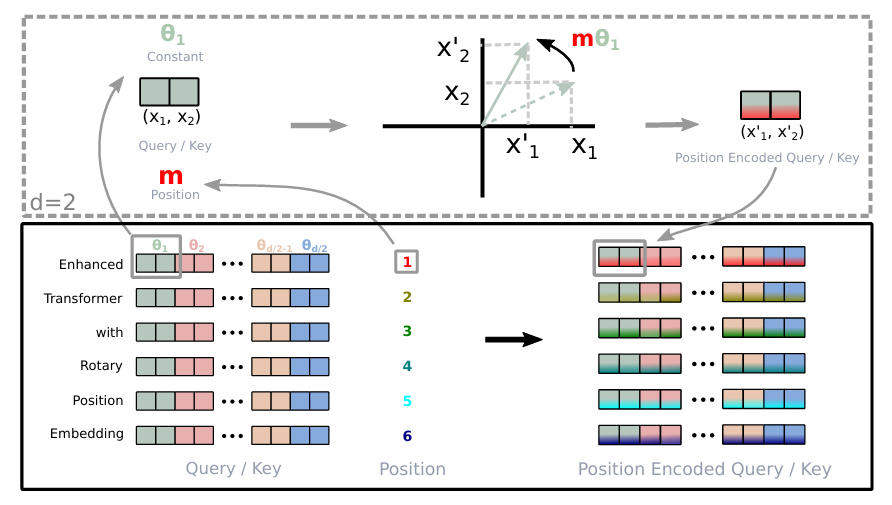
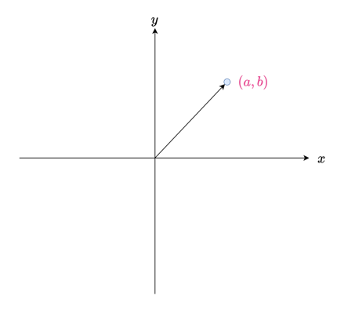
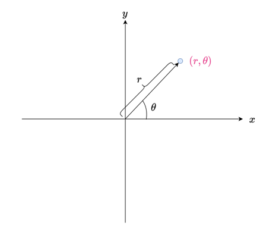
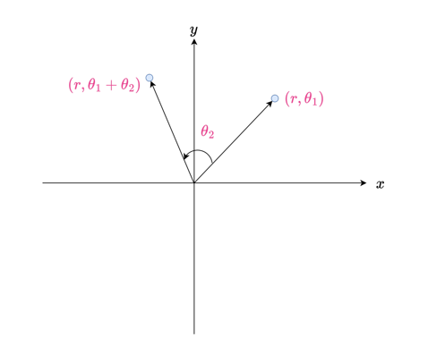
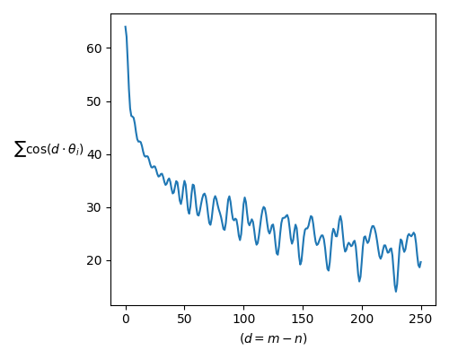

# RoPE: Rotary Position Embedding理论部分

**Rotary Position Embedding(RoPE，旋转位置嵌入)**，是一种相对位置编码的方法，在LLaMA、ChatGLM等模型中有广泛的应用，它缓解了LLM在处理比训练数据更长的文本时能力变差的问题，也就是说，它让**LLM在推理时处理比训练数据更长的序列时同样能够处理token间的位置关系**，也就是让LLM也具有了**外推**的能力。接下来我们就一起来学习一下RoPE

<div align="center">
    
    <p><b>RoPE</b>示意图</p>
</div>

**原论文链接: https://arxiv.org/pdf/2104.09864**

**作者在知乎中的讲解: https://zhuanlan.zhihu.com/p/359502624**

## 前置数学知识: 复数

### 复数的基本定义

在复数中，我们有:

$$
z = a + bi
$$

其中$a$为实部，$b$为虚部，$i$为虚数且满足$i^2 = -1$。我们可以在一个二维的坐标系中用一个点$(a, b)$表示$z$，其中$x$轴表示实部大小，$y$轴表示虚部大小，如下图所示:

<div align="center">
    
</div>

我们可以用类似极坐标$(r, \theta)$的形式表示$z$，其中$r$为坐标$(a, b)$到原点的距离，$\theta$表示与$x$轴的夹角，即我们有$z = r\cos\theta + r\sin\theta \cdot i$，如下图:

<div align="center">
    
</div>

根据**欧拉公式**，我们有如下形式:

$$
e^{i\theta} = \cos\theta + i\sin\theta
$$

带入$z = r\cos\theta + r\sin\theta \cdot i$，我们有:

$$
z = r e^{i\theta} = r(\cos\theta + i\sin\theta)
$$

### 复数下的向量内积

我们记$\text{Re}(z)$为取出复数$z$的实部，即$\text{Re}(z) = a$；记$z^*$为$z$的共轭复数，即$z^* = a - bi$

对于两个复数$z_1 = a_1 + b_1i$和$z_2 = a_2 + b_2i$，且它们对应的向量为$\vec{v}_1 = (a_1, b_1), \vec{v}_2 = (a_2, b_2)$，那么他们的内积就是:

$$
\vec{v}_1 \cdot \vec{v}_2 = a_1a_2 + b_1b_2
$$

注意到，若我们把$z_1$与$z^*_2$相乘，就有:

$$
\begin{align*}
z_1 \cdot z^*_2 &= (a_1 + b_1i)(a_2 - b_2i)
\\&= a_1a_2 - a_1b_2i+ a_2b_1i - b_1b_2i^2
\\&= a_1a_2 + b_1b_2 - a_1b_2i+ a_2b_1i
\end{align*}
$$

取出它的实部，即$\text{Re}(z_1 \cdot z^*_2) = a_1a_2 + b_1b_2 = \vec{v}_1 \cdot \vec{v}_2$，即**一个复数和另一个复数的共轭的乘积的实部就是它们对应的向量的内积**

### 复数乘积的几何意义

对于复数$z_1 = r e^{i\theta_1}$，假设我们把它和一个单位长度的复数$z_2 = e^{i\theta_2}$相乘，结果就是$z = r e^{i(\theta_1 + \theta_2)}$，**也就是把$z_1$对应的向量再旋转了$\theta_2$角度，也就是$z_1$的模长不变，辐角直接与$\theta_2$相加**，如下图所示:

<div align="center">
    
</div>

若$a_1 = r\cos\theta_1, b_1 = r\sin\theta_1$，即$\vec{v}_1 = (r\cos\theta_1, r\sin\theta_1)$，上面的旋转就表示成了:

$$
\begin{align*}
\begin{pmatrix}
\cos\theta_2 & -\sin\theta_2 \\
\sin\theta_2 & \cos\theta_2
\end{pmatrix}
\begin{pmatrix}
r\cos\theta_1 \\
r\sin\theta_1
\end{pmatrix}
=
\begin{pmatrix}
r\cos(\theta_1+\theta_2) \\
r\sin(\theta_1+\theta_2)
\end{pmatrix}
\end{align*}
$$

## RoPE

### 相对位置编码 vs. 绝对位置编码

之前在Transformer中，我们使用了正余弦位置编码，他算是一种**绝对位置编码**，也就是位置1一种编码，位置2一种编码，这种编码方式有一个缺点，就是不能很好地表示出位置的一个相对性，比如训练数据是“咕咕嘎嘎”，有4个位置，而推理时的数据“饿咕咕嘎嘎”有5个字，那么由于训练中模型没有见过第5个位置的位置编码，他就不能很好地处理第5个位置的位置信息，**也就是外推性比较差**

缓解这一问题的一个方式是使用**相对位置编码**，也就是建模每个位置间的相对位置关系，那么即使训练时只见过长度为4的数据“咕咕嘎嘎”，由于模型学习到了每个位置间的相对性，那么在推理时，遇到了更长的序列“饿咕咕嘎嘎”，那模型也知道最后一个位置相对之前的位置的关系(比如相对第4个位置，是位于它之后，从而建模第5个位置与第4个位置间的关系)，它也**仍然具有一定的外推能力，能够建模更长的位置间的关系**，而**RoPE**就是其中的一种，接下来我们就介绍一下它是如何得到的

### RoPE的推导

**RoPE是通过绝对位置编码的方式实现了相对位置编码的，也就是把相对性嵌入到了Q与K的运算之中了**。假设，我们给$\vec{q}$、$\vec{k}$添加了绝对位置信息，如下:

$$
\tilde{\vec{q}}_m = f(\vec{q}, m), \quad \tilde{\vec{k}}_n = f(\vec{k}, n)
$$

也就是给$\vec{q}$和$\vec{k}$分别编码了它们在序列中的绝对位置信息$m$和$n$，而我们知道Attention运算是在做内积，那么我们的目标就是找到一种位置编码方式$f(\cdot, pos)$，使得内积的结果带有相对位置信息:

$$
\langle f(\vec{q}, m), f(\vec{k}, n) \rangle = g(\vec{q}, \vec{k}, m - n) \tag{1}
$$

我们的目标就是求出满足上式的一个**尽可能简单**的解，那么我们就可以添加一些简单的约束条件，就假设$f(\vec{q}, 0) = \vec{q}$和$f(\vec{k}, 0) = \vec{k}$

**我们先考虑二维情形**。在复数前置知识的章节里，我们已经知道了，内积满足如下的形式:

$$
\langle \vec{q}, \vec{k} \rangle = \text{Re}(z_q \cdot z_k^*)
$$

其中$z_q$和$z_k$分别表示$\vec{q}$和$\vec{k}$对应的复数，那么带入我们的恒等式(1)，就有了:

$$
\text{Re}(z_{f(\vec{q}, m)} z^*_{f(\vec{k}, n)}) = g(\vec{q}, \vec{k}, m - n)
$$

同样是为了求出简单解，我们再添加一个约束，就是**假设存在一个复数$z_{g(\vec{q}, \vec{k}, m - n)}$**，满足:

$$
z_{g(\vec{q}, \vec{k}, m - n)} = z_{f(\vec{q}, m)} \cdot z^*_{f(\vec{k}, n)}
$$

利用**欧拉公式**，即$z = r\cos\theta + ir\sin\theta = r e^{i\theta}$，我们有:

$$
z_{f(\vec{q}, m)} = \parallel f(\vec{q}, m) \parallel e^{i\Theta_{f}(\vec{q}, m)}

\\

z_{f(\vec{k}, m)} = \parallel f(\vec{k}, m) \parallel e^{i\Theta_{f}(\vec{k}, m)}

\\

z_{g(\vec{q}, \vec{k}, m - n)} = \parallel g(\vec{q}, \vec{k}, m - n) \parallel e^{i\Theta_{g}(\vec{q}, \vec{k}, m-n)}
$$

其中$\Theta$表示复数对应坐标系下的辐角，那么我们就有如下的方程组:

$$
\begin{cases}
\begin{align}
\parallel f(\vec{q}, m) \parallel \parallel f(\vec{k}, n) \parallel
= \parallel g(\vec{q}, \vec{k}, m - n) \parallel \quad \tag{2} \\[6pt]
\Theta_{f}(\vec{q}, m) - \Theta_{f}(\vec{k}, n)
= \Theta_{g}(\vec{q}, \vec{k}, m-n) \quad \tag{3}
\end{align}
\end{cases}
$$

对于(2)，我们带入$m = n$，有:

$$
\begin{align*}
\parallel f(\vec{q}, m) \parallel \parallel f(\vec{k}, m) \parallel 
&= \parallel g(\vec{q}, \vec{k}, 0) \parallel 
\\&= \parallel f(\vec{q}, 0) \parallel \parallel f(\vec{k}, 0) \parallel 
\\&= \parallel \vec{q} \parallel \parallel \vec{k} \parallel \quad (f(*, 0) = *)
\end{align*}
$$

所以，**模长$\parallel f(\vec{q}, m) \parallel$和$\parallel f(\vec{k}, n) \parallel $可以等价为$\parallel \vec{q} \parallel$和$\parallel \vec{k} \parallel$**，即**模长部分不依赖于位置$m$和$n$**

对于(3)，我们同样带入$m = n$，有:

$$
\begin{align*}
\Theta_f(\vec{q}, m) - \Theta_f(\vec{k}, m)
&= \Theta_g(\vec{q}, \vec{k}, 0)

\\&= \Theta_f(\vec{q}, 0) - \Theta_f(\vec{k}, 0)

\\&= \Theta(\vec{q}) - \Theta(\vec{k}) \quad (\Theta_f(*, 0)就等于*本身的辐角\Theta(*))
\end{align*}
$$

即:

$$
\Theta_f(\vec{q}, m) - \Theta(\vec{q}) = \Theta_f(\vec{k}, m) - \Theta(\vec{k}) \quad (最后一个等号移项得到)
$$

也就是说，**变换$f(*, pos)$对于复数域中的角度的作用不依赖于向量，只和位置$pos$有关**，我们记$f(*, pos)$对于复数域中的角度的作用为$\varphi(pos)$，即$\Theta_f(\vec{q}, m) = \Theta(\vec{q}) + \varphi(m)$，如果$m$和$n$是相邻位置，即$n = m - 1$，那么我们有: 

$$
\begin{align*}
\varphi(m) - \varphi(m - 1)
&= (\Theta_f(\vec{q}, m) - \Theta(\vec{q})) - (\Theta_f(\vec{k}, m-1) - \Theta(\vec{k}))

\\&= \Theta_f(\vec{q}, m) - \Theta_f(\vec{k}, m - 1) + \Theta(\vec{k}) - \Theta(\vec{q})

\\&= \Theta_g(\vec{q}, \vec{k}, 1) + \Theta(\vec{k}) - \Theta(\vec{q})
\end{align*}
$$

即，**经过$f(*, pos)$作用后，其对复数域中角度项作用$\varphi(pos)$为一个等差数列**，右端为一个固定的常数，若我们记为$\theta$，依据$\varphi(0) = 0(f(*, 0)不改变*)$，那么就有:

$$
\begin{align*}
\varphi(m) 
&= \varphi(0) + (m - 0) \theta

\\&= m\theta
\end{align*}
$$

最后，我们在复数域上解出了作用$f(*, pos)$的形式:

$$
z_{f(\vec{q}, m)} = \parallel \vec{q} \parallel e^{i(\Theta({\vec{q}}) + m\theta)} = z_{\vec{q}} e^{im\theta}
$$

**回忆一下我们在复数部分的讲解**，这就是按照位置$m$把原始的向量$\vec{q}$**旋转**了$m\theta$个角度，我们把它写成矩阵变换的形式，也就得到了对向量$\vec{q}$的变换形式:

$$
f(\vec{q}, m) = 
\begin{pmatrix}
\cos m\theta & -\sin m\theta \\
\sin m\theta & \cos m\theta
\end{pmatrix} 
\begin{pmatrix}
q_0 \\
q_1
\end{pmatrix}
$$

那么怎么拓展到高维中呢？我们对于任意偶数维度$d$的RoPE，**表示为$m/2$组二维情况的拼接形式**，即:

$$
\underbrace{
\begin{pmatrix}
\cos m\theta_0 & -\sin m\theta_0 & 0 & 0 & \dots & 0 & 0 \\
\sin m\theta_0 & \cos m\theta_0 & 0 & 0 & \dots & 0 & 0 \\
0 & 0 & \cos m\theta_1 & -\sin m\theta_1 & \dots & 0 & 0 \\
0 & 0 & \sin m\theta_1 & \cos m\theta_1 & \dots & 0 & 0 \\
\vdots & \vdots & \vdots & \vdots & \ddots & \vdots & \vdots \\
0 & 0 & 0 & 0 & \dots & \cos m\theta_{d/2-1} & -\sin m\theta_{d/2-1} \\
0 & 0 & 0 & 0 & \dots & \sin m\theta_{d/2-1} & \cos m\theta_{d/2-1}
\end{pmatrix}
}_{W_m}
\begin{pmatrix}
q_0 \\ q_1 \\ q_2 \\ q_3 \\ \vdots \\ q_{d-2} \\ q_{d-1}
\end{pmatrix}
$$

其中$\theta_i = 10000^{-2i/d}$，也就表示成了:

$$
f(\vec{q}, m) = W_m \vec{q}
$$

或许你会问: 为什么不同组的$\theta$会不一样呢？如果所有组的$\theta$都是一样的，那么第0个位置和第360个位置(假设$\theta$为1°)的位置编码**就是一样的了**(周期为360°)，而如果改为不同的$\theta$，那么产生相同位置编码的$m$和$n$就要满足:

$$
(m - n)\theta_i = 2k\pi
$$

也就是要求所有的$(m - n)\theta_i$都要是360°的倍数，这在高维空间中(嵌入维度$d$很大时)比较难满足，也就**大大减少了不同位置的位置编码相同的尴尬情况**

最后，因为变换矩阵$W_m$很稀疏，所以一般通过如下公式实现:

$$
\begin{pmatrix}
q_0 \\ q_1 \\ q_2 \\ q_3 \\ \vdots \\ q_{d-2} \\ q_{d-1}
\end{pmatrix}
\otimes
\begin{pmatrix}
\cos m\theta_0 \\ \cos m\theta_0 \\ \cos m\theta_1 \\ \cos m\theta_1 \\ \vdots \\ \cos m\theta_{d/2-1} \\ \cos m\theta_{d/2-1}
\end{pmatrix}
+
\begin{pmatrix}
-q_1 \\ q_0 \\ -q_3 \\ q_2 \\ \vdots \\ -q_{d-1} \\ q_{d-2}
\end{pmatrix}
\otimes
\begin{pmatrix}
\sin m\theta_0 \\ \sin m\theta_0 \\ \sin m\theta_1 \\ \sin m\theta_1 \\ \vdots \\ \sin m\theta_{d/2-1} \\ \sin m\theta_{d/2-1}
\end{pmatrix}
$$

其中$\otimes$表示逐元素乘法

那么实际实现就如下图所示:

<div align="center">
    
</div>

### 远程衰减

RoPE编码给编码之后的Q和K的运算结果带来了一定的**远程衰减**特性，也就是说，$\vec{q}$和$\vec{k}$相对位置$(m - n)$越大，RoPE对于他俩的内积结果的缩减作用就越大，接下来我们就结合Python的绘图库探究一下

我们知道，对$\vec{q}$和$\vec{k}$进行RoPE编码之后得到$\tilde{\vec{q}}$和$\tilde{\vec{k}}$，之后它们的内积可以这样计算，也就是按照维度两两分组计算内积再求和:

$$
\begin{align*}
\tilde{\vec{q}} \cdot \tilde{\vec{k}} 

&= \text{Re}(z_{\tilde{\vec{q}}} \cdot z^*_{\tilde{\vec{k}}})

\\&= Re(\sum_{i=0}^{d/2 - 1} \parallel \vec{q}[2i:2i+1] \parallel \parallel \vec{k}[2i:2i+1] \parallel e^{i(m-n)\theta_i})
\end{align*}
$$

因为**RoPE编码对于向量本身的长度没有作用，为了简化，我们假设两个向量为全1向量**，那么就有:

$$
\begin{align*}
Re(\sum_{i=0}^{d/2 - 1} \parallel \vec{q}[2i:2i+1] \parallel \parallel \vec{k}[2i:2i+1] \parallel e^{i(m-n)\theta_i})

&= Re(\sum_{i=0}^{d/2 - 1} e^{i(m-n)\theta_i})

\\&= Re(\sum_{i=0}^{d/2 - 1} \cos((m - n)\theta_i) + i \sin((m - n)\theta_i))

\\&= \sum_{i=0}^{d/2 - 1} \cos((m - n)\theta_i)
\end{align*}
$$

那么我们就以相对位置$(m - n)$为横轴，$\sum_{i=0}^{d/2 - 1} \cos((m - n)\theta_i)$为纵轴绘制一个图像，Python代码如下:

```python
import numpy as np
import matplotlib.pyplot as plt


HEAD_DIM = 128
MAX_DIST = 250


def draw(head_dim:int, max_dist:int):
    num_pairs = head_dim//2
    i = np.arange(num_pairs)
    theta_i = 10000.0 ** (-2*i / head_dim)

    relative_dist = np.arange(max_dist+1)

    scores = []
    for dist in relative_dist:
        score = np.sum(np.cos(dist*theta_i))
        scores.append(score)

    scores_norm = scores / scores[0]

    plt.figure(figsize=(5, 4))
    plt.plot(relative_dist, scores)
    plt.xlabel('$(d = m - n)$')
    plt.ylabel(r'$\sum \cos(d \cdot \theta_i)$', rotation=0, labelpad=30)

    plt.tight_layout()
    plt.show()


if __name__ == "__main__":
    draw(HEAD_DIM, MAX_DIST)
```

结果如下图:

<div align="center">
    
</div>

可以看到，计算的内积值是震荡性衰减的，相对距离较远时，内积值已经比最初时小了很多了，也就让注意力给予相对位置较远的token更小的权重了
